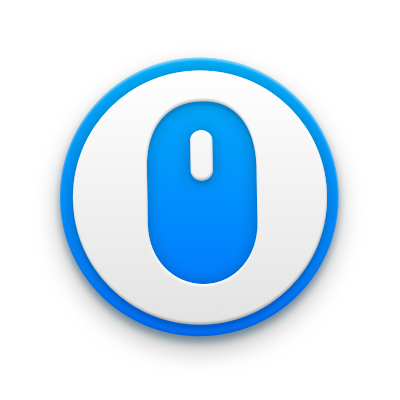

<!-- 

 -->

	
	<h1>Mac Mouse Fix</h1>  
    
<b>Make Your $10 Mouse Better Than an Apple Trackpad!<b>

     
     
        <table>
        <th><a href=https://noah-nuebling.github.io/mac-mouse-fix-website>Download</a></th>
        <td><a href=https://github.com/noah-nuebling/mac-mouse-fix/releases>Releases</a></td>
        <td><a href=https://github.com/noah-nuebling/mac-mouse-fix/discussions>Help</a></td>
        <td><a href=https://github.com/noah-nuebling/mac-mouse-fix/discussions>Feedback</a></td>
    </table>
     
     

<!-- <h3 align="center">
<a href=https://noah-nuebling.github.io/mac-mouse-fix-website>Download</a> |
<a href=https://github.com/noah-nuebling/mac-mouse-fix/releases>Releases</a> |
<a href=https://github.com/noah-nuebling/mac-mouse-fix/discussions>Help &  Feedback</a>
</h3> -->

This is a macOS app for the [`gifski` encoder](https://gif.ski), which converts videos to GIF animations using [`pngquant`](https://pngquant.org)'s fancy features for efficient cross-frame palettes and temporal dithering. It produces animated GIFs that use thousands of colors per frame and up to 50 FPS (useful for showing off design work on Dribbble).

You can also produce smaller lower quality GIFs when needed with the “Quality” slider, thanks to [`gifsicle`](https://github.com/kohler/gifsicle).

Gifski supports all the video formats that macOS supports (`.mp4` or `.mov` with H264, HEVC, ProRes, etc). The [QuickTime Animation format](https://en.wikipedia.org/wiki/QuickTime_Animation) is not supported. Use [ProRes 4444 XQ](https://en.wikipedia.org/wiki/Apple_ProRes) instead. It's more efficient, more widely supported, and like QuickTime Animation, it also supports alpha channel.

Gifski has a bunch of settings like changing dimensions, speed, frame rate, quality, looping, and more.

## Download

Requires macOS 11 or later.

**Older versions**

- [Last macOS 10.15 compatible version](https://github.com/sindresorhus/Gifski/releases/download/v2.20.2/Gifski.2.20.2.-.macOS.10.15.zip) *(2.20.2)*
- [Last macOS 10.14 compatible version](https://github.com/sindresorhus/Gifski/releases/download/v2.16.0/Gifski.2.16.0.-.macOS.10.14.zip) *(2.16.0)*
- [Last macOS 10.13 compatible version](https://github.com/sindresorhus/Gifski/files/3991913/Gifski.2.4.0.-.High.Sierra.zip) *(2.4.0)*

## Features

### Share extension

Gifski includes a share extension that lets you share videos to Gifski. Just select Gifski from the Share menu of any macOS app.

> Tip: You can share a macOS screen recording with Gifski by clicking on the thumbnail that pops up once you are done recording and selecting “Share” from there.

### System service

Gifski includes a [system service](https://www.computerworld.com/article/2476298/os-x-a-quick-guide-to-services-on-your-mac.html) that lets you quickly convert a video to GIF from the **Services** menu in any app that provides a compatible video file.

### Bounce (yo-yo) GIF playback

Gifski includes the option to create GIFs that bounce back and forth between forward and backward playback. This is a similar effect to the bounce effect in [iOS's Live Photo effects](https://support.apple.com/en-us/HT207310). This option doubles the number of frames in the GIF so the file size will double as well.

## Features

Mac Mouse Fix bla blub. Here's to the crazy ones. The misfits. The rebels. The troublemakers. The round pegs in the square holes. The ones who see things differently. Mac Mouse Fix bla blub. Here's to the crazy ones. The misfits. The rebels. The troublemakers. The round pegs in the square holes. The ones who see things differently.
Mac Mouse Fix bla blub. Here's to the crazy ones. The misfits. The rebels. The troublemakers. The round pegs in the square holes. The ones who see things differently.

Mac Mouse Fix bla blub. Here's to the crazy ones. The misfits. The rebels. The troublemakers. The round pegs in the square holes. The ones who see things differently. Mac Mouse Fix bla blub. Here's to the crazy ones. The misfits. The rebels. The troublemakers. The round pegs in the square holes. The ones who see things differently.
Mac Mouse Fix bla blub. Here's to the crazy ones. The misfits. The rebels. The troublemakers. The round pegs in the square holes. The ones who see things differently.

## FAQ

## Press

## License

## Acknowledgements

Click [here](google.com)

---

 You can now test the [**Mac Mouse Fix 3**](https://github.com/noah-nuebling/mac-mouse-fix/releases/) Beta!

 ---
 ---

	
	<h1>Mac Mouse Fix</h1>
	

		<b>Make Your $10 Mouse Better Than an Apple Trackpad!</b>
	

	 
	 
	 

---

	

    

		<b>Make Your $10 Mouse Better Than an Apple Trackpad!</b>
	

	 
	 
	 

