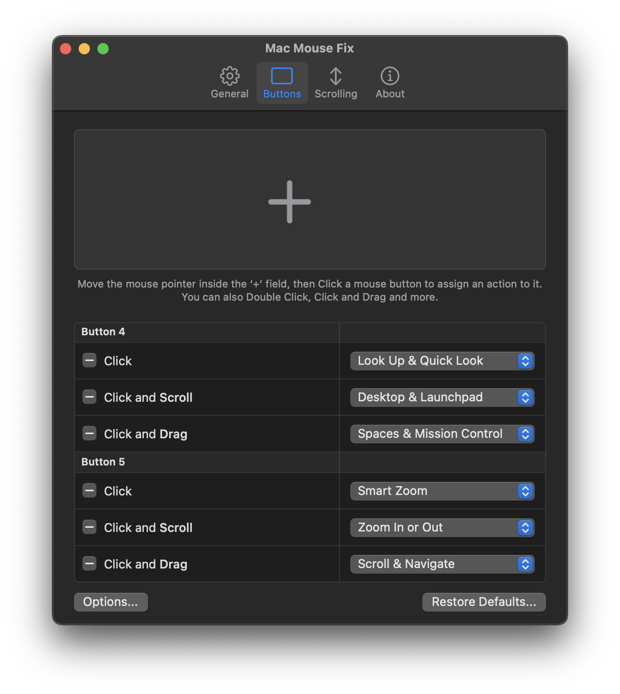
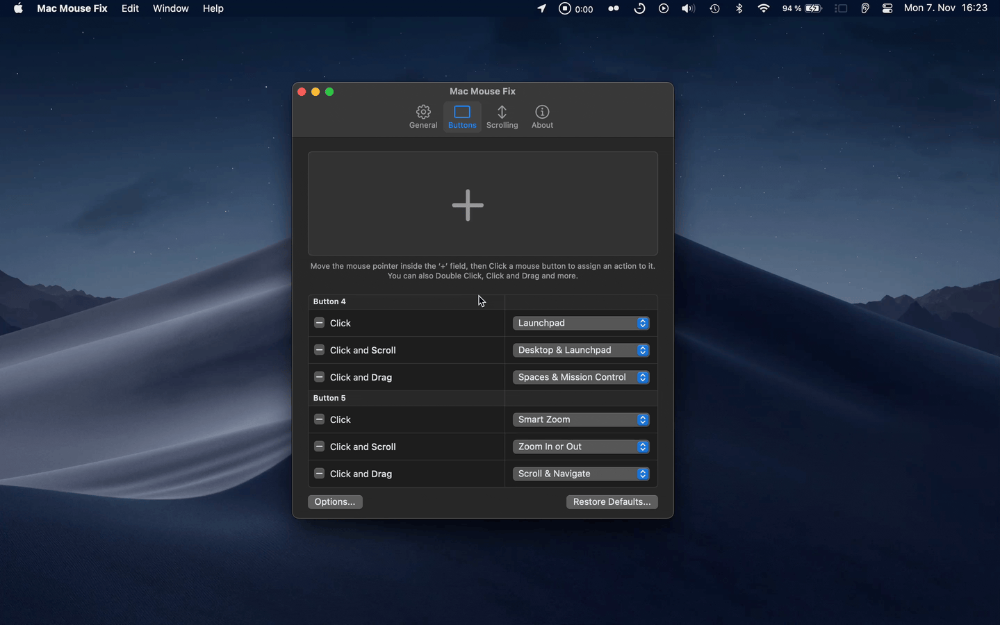

<!-- This README is greatly inspired by / stolen from sindresorhus/Gifski and sindresorhus/caprine -->

<table align="center">
	<tr>
	    <td align="center">You can now test the <a href="https://github.com/noah-nuebling/mac-mouse-fix/releases/">Mac Mouse Fix 3 Beta!</a></td>
	</tr>
</table>
 

	
	<h1>Mac Mouse Fix</h1>  
    
Make Your $10 Mouse Better Than an Apple Trackpad!

 
 

	<table>
        <th><a href=https://noah-nuebling.github.io/mac-mouse-fix-website>Download</a></th>
        <td><a href=https://github.com/noah-nuebling/mac-mouse-fix/releases>Releases</a></td>
        <td><a href=https://github.com/noah-nuebling/mac-mouse-fix/discussions>Help</a></td>
        <td><a href=https://github.com/noah-nuebling/mac-mouse-fix/discussions>Feedback</a></td>
    </table>
	

 
<!--Use this second br when theres text above the first header -->
 

TODO: 
- Add questions from 3.0.0 Monetization FAQ

Mac Mouse Fix I want to make the best mouse driver ever! I think it's pretty gewd already.

<!-- 

 -->

<!-- <h3 align="center">
<a href=https://noah-nuebling.github.io/mac-mouse-fix-website>Download</a> |
<a href=https://github.com/noah-nuebling/mac-mouse-fix/releases>Releases</a> |
<a href=https://github.com/noah-nuebling/mac-mouse-fix/discussions>Help &  Feedback</a>
</h3> -->

<!-- This is a macOS app for the [`gifski` encoder](https://gif.ski), which converts videos to GIF animations using [`pngquant`](https://pngquant.org)'s fancy features for efficient cross-frame palettes and temporal dithering. It produces animated GIFs that use thousands of colors per frame and up to 50 FPS (useful for showing off design work on Dribbble).

You can also produce smaller lower quality GIFs when needed with the “Quality” slider, thanks to [`gifsicle`](https://github.com/kohler/gifsicle).

Gifski supports all the video formats that macOS supports (`.mp4` or `.mov` with H264, HEVC, ProRes, etc). The [QuickTime Animation format](https://en.wikipedia.org/wiki/QuickTime_Animation) is not supported. Use [ProRes 4444 XQ](https://en.wikipedia.org/wiki/Apple_ProRes) instead. It's more efficient, more widely supported, and like QuickTime Animation, it also supports alpha channel.

Gifski has a bunch of settings like changing dimensions, speed, frame rate, quality, looping, and more. -->

## Features

Header Ideas: Mouse Gestures done right, major boost to productivity, ??meunu bar item, ?trackpad-like scrolling

### Do the things you do on a Trackpad, without a Trackpad!

- Default config lets you do everything you do on Trackpad!
  - Move between Spaces, Open Mission Control or App Exposé, Open Launchpad, Show the desktop, Look up words, Quick Look files in the Finder, go back and forwards in apps like Safari, Zoom in and out on the Web and elsewhere, use smartzoom, 360 degree free scrolling for pro apps.
  - All using 2 buttons in a simple and intuitive setup - just as easy and fun and responsive as trackpad!
- Click and Drag Gestures + Click and Scroll Gestures - feels super great
- (If you're using 3 button mouse won't be quite as powerful)

### Smooth, Responsive Scrolling

- Feels great. Easy to control.
- "Inertial scrolling" makes scrolling as lucious and super smooth as a trackpad
- No hard to control acceleration
- No stuttery jumps that disorientate your eyes make you feel like you're still in the 90s
- ^ Make this POSITIVE. Not what's bad about default
- Super easy to setup and configure to your liking

### Unobtrusive, Lightweight, Polished, Easy to use - good software!

Mac Mouse Fix wil feel like natural extension of your Mac or sth.

### Endless customization - in seconds

Action Table gives infinte options in extremely fast and easy UI

### Well-thought-out, beautiful UI

? Let people see this from other vids/screenshots, don't explicitly say this ?

### Details

For all the features see Releases.

Major features were introduced in these releases:

[0.9](https://github.com/noah-nuebling/mac-mouse-fix/releases/tag/0.9.0)
| [1.0.0](https://github.com/noah-nuebling/mac-mouse-fix/releases/tag/1.0.0)
| [2.0.0](https://github.com/noah-nuebling/mac-mouse-fix/releases/tag/2.0.0)
| [2.1.0](https://github.com/noah-nuebling/mac-mouse-fix/releases/tag/2.1.0)
| 3.0.0

## Pricing

- Mac Mouse Fix is free for 30 days and it costs $1.99 to own.
- Days on which you don't use Mac Mouse Fix won't use up your free days.
- You can pay in a few clicks from inside the app using Apple Pay, PayPal, and more.

## Questions

**Does Mac Mouse Fix track my information?**

I'm committed to your privacy. Mac Mouse Fix does not have ads and it doesn't track any information about you. 
If you have automatic updates turned on, Mac Mouse Fix will ping Github's servers every time you launch the app to ask for an update. I can't retrieve any information about that however.

**Is Mac Mouse Fix compatible with the Apple Magic Mouse?**

Mac Mouse Fix currently has no effect on the Apple Magic Mouse. Maybe I will add features in the future which work with the Magic Mouse.

**Is my Logitech / Razor Mouse compatible?**

Yes but some buttons might not work properly because poopoo custom protocol + onboard memory.

Same is true for Glorious, ?Steelseries

I want to add this but it's not coming soon!!

You can use SteerMouse or proprietary driver like Logitech Options instead.

**Can I use tilting wheel for buttons?**

No you dumbo

**Pointer Speedd / Turn off acceleration??**

Not yet, but here are alternatives <...>. Adding it soon and !! (I hope) (and better than everyone else hehe)

**Click delay**

When you click, MMF will wait to see if you're going to double click. Delete the "Double Click" Action to remove the delay. More info here.

**Blender Compatibility**

If you have actions mapped to middle button, use Scroll and navigate (or Click and drag sim?) to still navigate in Blender. Or uncapture Middle button (maybe make this a guide on its own?)

## What people say

These cool articles were written about MMF

- Lifehacker
- Blib blob (Japanese)
- Not CNET review

These are great compliments that I / Mac Mouse Fix have received from users. They made me smile and they made my crippling self esteem issues a little better:

- "God Among Men" - Guy on Stackexchange
-  (Not complete by any means! Thanks to everythingn who wrote something nice!!)

## Tips

**Brightness, Volume, and Media controls right from your mouse!**

MMF Let's you use any key on your keyboard directly from your mouse.
Even keys only found on Apple keyboards like 'Increase Brightness', 'Decrease Volume' or 'Play-Pause'. 

If you don't have Apple Keyboard at hand, hold Option (⌥) to reveal the Apple-Keyboard exclusive keys in a dropdown menu!

You can also use keyboard shorcuts to do anything from your mouse by hooking into other stuff like Apple Shortcuts!

P sick right?

## macOS Compatibility

The latest version of Mac Mouse Fix requires macOS **10.13 High Sierra** or later.

If you're on macOS **10.11 El Capitan** and macOS **10.12 Sierra**, get [2.2.0](https://github.com/noah-nuebling/mac-mouse-fix/releases/tag/2.2.0) or below.

## Contributing

If you have questions about building the app on your computer ask in this GH Discussion

### Translations

I'd love to have the app available in many languages.

You'll also get rewards X Y and Z for translating

?Here are the langs it's been translated to

?Here are missing/incoplete translations ?And their bounties?

?Note these things when translateing? (download barty crouch)

?Here ar the basic steps?

?Ask here / view this guide if you have questions about how to translate.

### Bug Reports and Enhancement requests

When you find a bug in MMF or have an idea how it could be even better use Feedback Assistant!

(You can also start Discussion for ?open ended / quick feedback / idk??)

### Pull requests

I'll be happy about any pull requests! Hope my code isn't too terrible heh. 

## License

Mac Mouse Fix 3 and above are licensed under the MMF License. It says you can do whatever you want with Mac Mouse Fix and its source code except release a blatant copy!

More info in the [LICENSE](https://github.com/noah-nuebling/mac-mouse-fix/blob/master/LICENSE) file.

## Acknowledgements

Mac Mouse Fix wouldn't be the same without these [awesome contributions](Acknowledgements.md)

<!-- 

	
	<h1>Mac Mouse Fix</h1>
	

		<b>Make Your $10 Mouse Better Than an Apple Trackpad!</b>
	

	 
	 
	 

---

	

    

		<b>Make Your $10 Mouse Better Than an Apple Trackpad!</b>
	

	 
	 
	 

 -->
